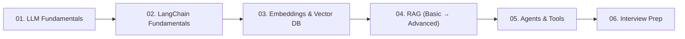

# LLM & RAG Learning Notes

Beginner → Advanced notes with diagrams and runnable mini-projects. Companion to `AI_Engineer_Learning_Plan.md` (maps roughly to Phases 2–5).

## Folder Map

| File | Covers |
|---|---|
| [01_LLM_Fundamentals.md](01_LLM_Fundamentals.md) | Tokens, context window, temperature, roles, prompting, structured output, limitations |
| [02_LangChain_Fundamentals.md](02_LangChain_Fundamentals.md) | Models, Prompts, Messages, Output Parsers, Chains, Runnables, LCEL, tool calling |
| [03_Embeddings_VectorDB.md](03_Embeddings_VectorDB.md) | Embeddings, similarity, chunking, vector databases, indexes |
| [04_RAG_Fundamentals_to_Advanced.md](04_RAG_Fundamentals_to_Advanced.md) | Naive RAG → advanced RAG (re-ranking, hybrid search, agentic RAG, evaluation) |
| [05_Agents_and_Tools.md](05_Agents_and_Tools.md) | ReAct, tool calling, LangGraph, multi-agent basics |
| [06_Interview_Questions.md](06_Interview_Questions.md) | Q&A bank for LLM, LangChain, RAG topics |
| [projects/](projects/) | Runnable mini-project code |

## Suggested Reading Order

## Mini Projects Included

1. **Technical Q&A Assistant** (structured output) — `projects/01_qa_assistant.py`
2. **PDF/Docs RAG Chatbot** — `projects/02_rag_chatbot.py`
3. **RAG with Re-ranking + Citations** — `projects/03_advanced_rag.py`
4. **SQL Agent (tool calling)** — `projects/04_sql_agent.py`

Each project has a header comment with setup + run instructions and only needs `OPENAI_API_KEY` (or swap in any LangChain-supported provider, e.g. Ollama for local/free models).
