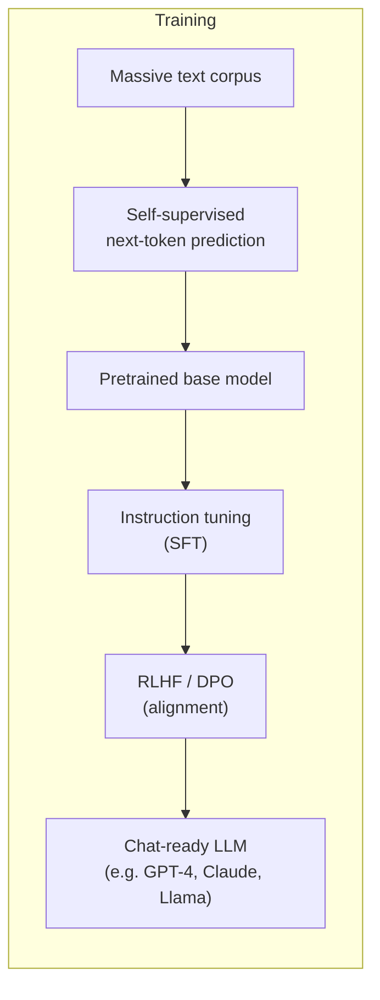
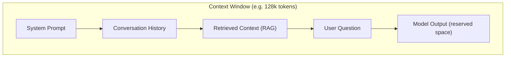
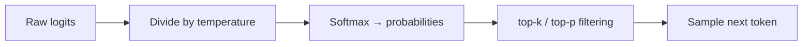
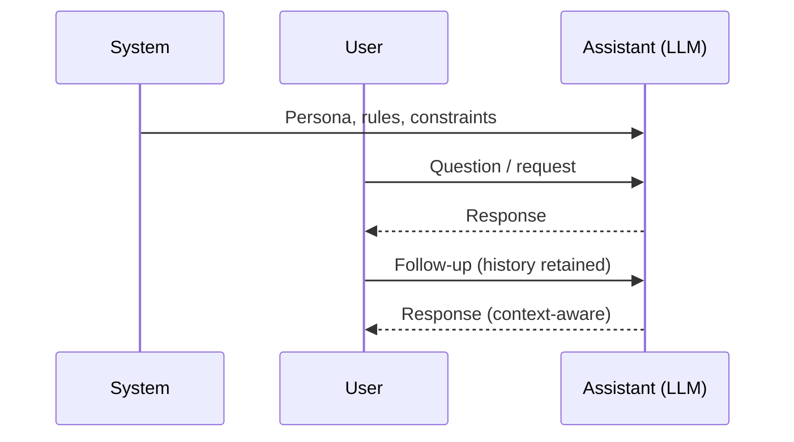
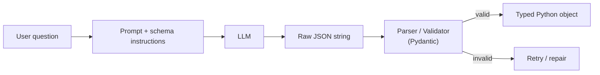

# 01. LLM Fundamentals

## 1. What is an LLM?

A **Large Language Model (LLM)** is a neural network (almost always a **Transformer decoder**) trained on massive text corpora to predict the *next token* given previous tokens. Everything an LLM does — chat, summarize, code, reason — is an emergent behavior of this single objective: **next-token prediction**.



Key mental model:

> An LLM is a **function**: `f(tokens_so_far) -> probability distribution over next token`. Generation = repeatedly sampling from that distribution.

## 2. Tokens

LLMs don't see words — they see **tokens**, sub-word units produced by a tokenizer (e.g., Byte-Pair Encoding / BPE, or `tiktoken` for OpenAI models).

```
"Data Quality Framework" 
        │  tokenizer.encode()
        ▼
[3423, 20336, 25859, 12474]   ← 4 tokens (not 3 words!)
```

- 1 token ≈ 4 characters ≈ ¾ of a word in English.
- Cost and context limits are measured in tokens, **not** characters or words.
- Rare words / code / non-English text often use *more* tokens per word.

**Why it matters:**
- API pricing = `(input tokens + output tokens) × price per token`.
- Long prompts silently eat into your context budget.

```python
import tiktoken
enc = tiktoken.encoding_for_model("gpt-4o-mini")
print(len(enc.encode("Data Quality Framework")))  # -> token count
```

## 3. Context Window

The **context window** is the maximum number of tokens (input + output combined) the model can "see" at once — its working memory.



- If total tokens exceed the window, older messages must be truncated/summarized, or you get an error.
- This is **why RAG exists**: instead of stuffing an entire knowledge base into the prompt, you retrieve only the relevant chunks that fit the window.
- Bigger context window ≠ free lunch: "lost in the middle" — models attend less reliably to info buried in the middle of a huge context.

## 4. Temperature (and top-p / top-k)

Controls **randomness** of next-token sampling.

| Setting | Effect | Use case |
|---|---|---|
| `temperature=0` | Deterministic, picks most likely token | Structured extraction, code, math |
| `temperature=0.3–0.7` | Balanced creativity | General assistants |
| `temperature=1.0+` | High randomness/diversity | Brainstorming, creative writing |



- **top-p (nucleus sampling)**: sample from the smallest set of tokens whose cumulative probability ≥ p (e.g., 0.9).
- **top-k**: only consider the k most likely next tokens.
- Rule of thumb: for deterministic/reproducible pipelines (RAG answers, data extraction), keep `temperature=0`.

## 5. System / User / Assistant Messages

Chat LLMs are trained on a **role-based conversation format**:



- **system**: sets behavior/persona/rules ("You are a data-quality expert. Always answer in JSON.")
- **user**: the human's input.
- **assistant**: the model's own prior replies (included in history for multi-turn context).
- Some providers add **tool/function** role for tool call results.

```python
messages = [
    {"role": "system", "content": "You are a concise SQL expert."},
    {"role": "user", "content": "Explain a LEFT JOIN in one sentence."},
]
```

## 6. Prompt Engineering Basics

Prompting patterns you should know cold:

| Pattern | Idea | Example |
|---|---|---|
| **Zero-shot** | Just ask | "Summarize this text." |
| **Few-shot** | Give examples | "Q: ... A: ... Q: ... A: ... Q: {new} A:" |
| **Chain-of-Thought (CoT)** | Ask model to reason step by step | "Think step by step before answering." |
| **Self-consistency** | Sample multiple CoT paths, majority vote | Run 5x, pick most common answer |
| **ReAct** | Interleave Reasoning + Acting (tool calls) | "Thought → Action → Observation" loop |
| **Role prompting** | Assign persona | "You are a senior DBA reviewing this query." |

General best practices:
- Be specific about format ("respond in valid JSON with keys: answer, confidence").
- Put instructions near the start **and** end for long prompts (recency + primacy).
- Show, don't just tell — one good example beats three sentences of description.
- Iterate: prompt engineering is empirical, not one-shot.

## 7. Structured Output

Instead of free-text, force the model into a **schema** (JSON, Pydantic model) so downstream code can parse it reliably.



Two common approaches:
1. **Prompt-based**: instruct the model to output JSON matching a schema (works everywhere, needs validation + retry logic).
2. **Native structured output / function calling**: provider-level guarantee (OpenAI `response_format`, tool/function calling) — much more reliable.

```python
from pydantic import BaseModel

class Answer(BaseModel):
    answer: str
    confidence: float
    sources: list[str] = []
```

## 8. LLM Limitations

- **Hallucination** — confidently generates plausible-but-false facts (no built-in "I don't know" unless trained/prompted for it).
- **Knowledge cutoff** — no awareness of events after training data cutoff, unless given retrieved/live context.
- **No real memory** — each API call is stateless; "memory" is just re-sending history/context.
- **Context window limits** — can't reason over unlimited documents at once.
- **Arithmetic/logic weaknesses** — better with tools (calculator, code execution) than raw mental math.
- **Prompt injection risk** — untrusted text (web pages, documents, emails) can contain instructions that hijack the model; never treat retrieved/external content as trusted commands.
- **Bias & non-determinism** — reflects biases in training data; even at `temperature=0`, outputs can vary slightly across model versions.
- **Cost/latency** — bigger models = slower + more expensive; right-size the model to the task.

## 9. LLM vs Traditional ML (quick contrast)

| | Traditional ML | LLM |
|---|---|---|
| Input | Structured features | Raw text/tokens |
| Training | Task-specific, supervised | Self-supervised pretraining + fine-tune |
| Output | Label/number | Free-form text (or structured via prompting) |
| Generalization | Narrow (one task) | Broad (many tasks via prompting, "few-shot") |
| Deployment | Train your own model | Mostly call a pretrained model via API/prompt |

---
⬅ Back to [00_README.md](00_README.md) | Next: [02_LangChain_Fundamentals.md](02_LangChain_Fundamentals.md)
