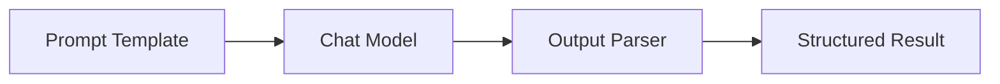
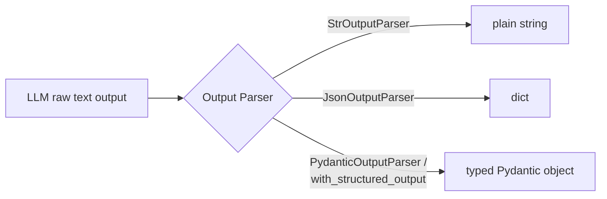
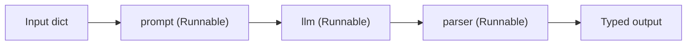
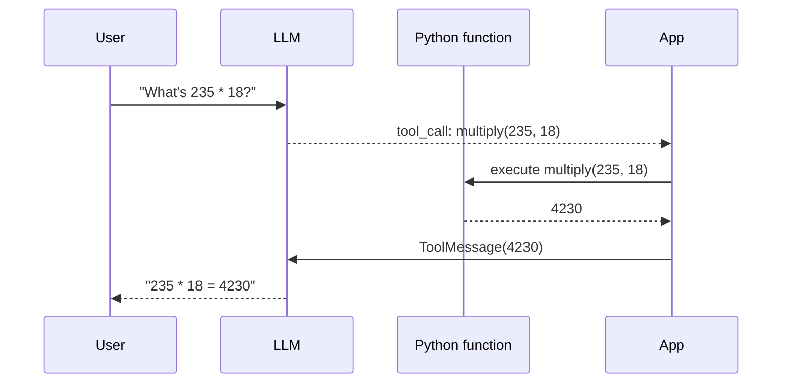
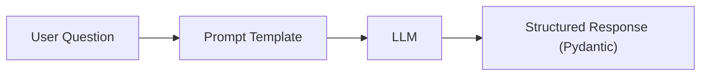

# 02. LangChain Fundamentals

## 1. What is LangChain?

LangChain is a framework for building LLM applications by composing **standardized building blocks** (models, prompts, parsers, retrievers, tools) into **pipelines ("chains")**, instead of hand-wiring API calls and string formatting yourself.



**Why use LangChain instead of raw API calls?**
- Consistent interface across providers (OpenAI, Anthropic, Azure, Ollama, etc.) — swap models with one line.
- Built-in output parsers (JSON, Pydantic, lists) instead of hand-rolled `json.loads` + error handling.
- Composable pipelines via **LCEL** (`|` operator) that support streaming, batching, async, retries for free.
- Ready-made integrations: vector stores, retrievers, document loaders, agents, memory.
- Tracing/observability via LangSmith.

**When you *don't* need it:** a single simple API call with no chaining/retrieval — raw SDK is simpler and has less abstraction overhead.

## 2. Models

LangChain wraps LLM providers behind a common interface:

- `ChatModel` — chat-style models (most common today): `ChatOpenAI`, `ChatAnthropic`, `ChatOllama`.
- `LLM` (legacy) — plain text-completion models (mostly superseded by chat models).
- `Embeddings` — text → vector models: `OpenAIEmbeddings`, `HuggingFaceEmbeddings`.

```python
from langchain_openai import ChatOpenAI

llm = ChatOpenAI(model="gpt-4o-mini", temperature=0)
```

## 3. Prompts (Prompt Templates)

Reusable, parameterized prompt text — avoids string concatenation and keeps prompts version-controllable/testable.

```python
from langchain_core.prompts import ChatPromptTemplate

prompt = ChatPromptTemplate.from_messages([
    ("system", "You are a helpful {domain} expert. Answer concisely."),
    ("human", "{question}"),
])
```

`prompt.invoke({"domain": "SQL", "question": "What is a CTE?"})` renders it into actual messages.

## 4. Messages

The typed representation of a conversation (mirrors the system/user/assistant roles from LLM fundamentals):

| Class | Role |
|---|---|
| `SystemMessage` | Instructions/persona |
| `HumanMessage` | User input |
| `AIMessage` | Model's response (may include `tool_calls`) |
| `ToolMessage` | Result of a tool/function call, sent back to the model |

```python
from langchain_core.messages import SystemMessage, HumanMessage

messages = [
    SystemMessage(content="You are terse."),
    HumanMessage(content="Define an index."),
]
llm.invoke(messages)
```

## 5. Output Parsers

Convert raw model output (string) into structured Python objects.



```python
from pydantic import BaseModel, Field
from langchain_core.output_parsers import PydanticOutputParser

class QAResult(BaseModel):
    answer: str = Field(description="the direct answer")
    confidence: float = Field(description="0-1 confidence score")

parser = PydanticOutputParser(pydantic_object=QAResult)
```

Modern preferred approach — `llm.with_structured_output(QAResult)` uses the provider's native structured-output/tool-calling support (more reliable than asking the model to "please output JSON").

## 6. Chains

A **chain** = a sequence of steps (prompt → model → parser) that together perform a task. Historically built with classes like `LLMChain`; today built declaratively with **LCEL**.

## 7. Runnables & LCEL (LangChain Expression Language)

Every LangChain component (`prompt`, `llm`, `parser`, `retriever`) implements the **`Runnable`** interface: a uniform contract with `.invoke()`, `.batch()`, `.stream()`, `.ainvoke()`.

**LCEL** lets you compose Runnables with the pipe operator `|`, like Unix pipes:

```python
chain = prompt | llm | parser
result = chain.invoke({"domain": "SQL", "question": "What is a CTE?"})
```



Benefits gained automatically from LCEL composition:
- **Streaming** — tokens stream through the whole pipeline, not just the LLM call.
- **Batching** — `chain.batch([...])` runs multiple inputs efficiently.
- **Async** — `await chain.ainvoke(...)` for free.
- **Composable** — chains can be nested inside other chains (`RunnableParallel`, `RunnableBranch`, `RunnableLambda` for custom functions).

### Chain vs Runnable (important interview distinction)

| | Chain (legacy, e.g. `LLMChain`) | Runnable / LCEL |
|---|---|---|
| Style | Class-based, imperative | Declarative composition with `\|` |
| Extensibility | Harder to customize internals | Easy to insert custom steps (`RunnableLambda`) |
| Streaming/async/batch | Not automatic | Built-in for every step |
| Current recommendation | Legacy/deprecated for new code | **Preferred** approach |

> In short: a "chain" is the *concept* (a pipeline of steps); a "Runnable"/LCEL is the *modern implementation mechanism* LangChain uses to build chains.

## 8. Basic Tool Calling

Tools let the LLM request that **your code** run a function (e.g., a calculator, SQL query, web search), then feed the result back in.



```python
from langchain_core.tools import tool

@tool
def multiply(a: int, b: int) -> int:
    """Multiply two integers."""
    return a * b

llm_with_tools = llm.bind_tools([multiply])
response = llm_with_tools.invoke("What's 235 * 18?")
print(response.tool_calls)  # -> [{'name': 'multiply', 'args': {'a':235,'b':18}, ...}]
```

The model itself never executes code — it only *decides* to call a tool and *proposes arguments*; your application code executes it and returns the result.

---
⬅ Back: [01_LLM_Fundamentals.md](01_LLM_Fundamentals.md) | Next: [03_Embeddings_VectorDB.md](03_Embeddings_VectorDB.md)

## Hands-on: Question → Prompt Template → LLM → Structured Response



See runnable version: [projects/01_qa_assistant.py](projects/01_qa_assistant.py)
