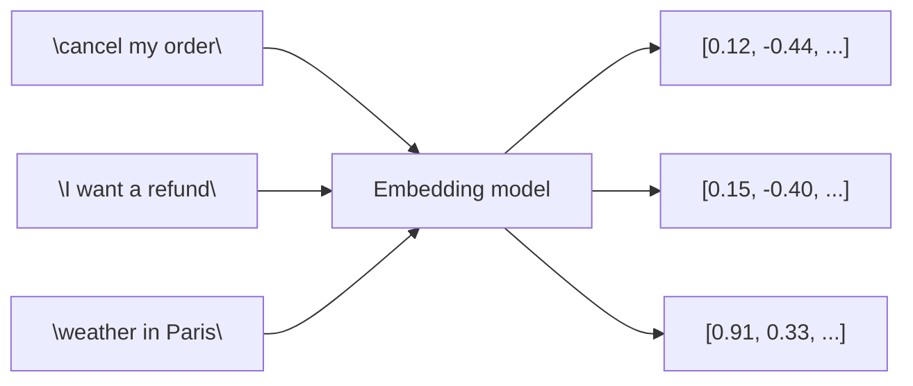
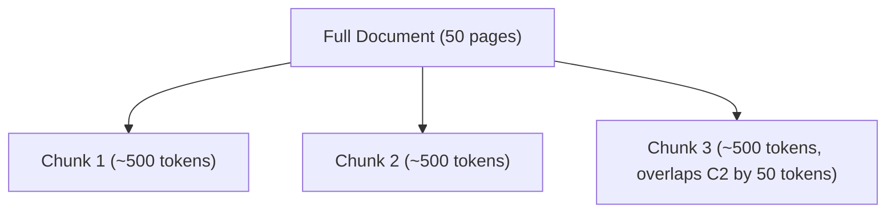
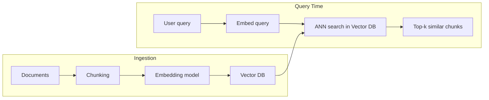

# 03. Embeddings & Vector Databases

## 1. What is an Embedding?

An **embedding** is a dense numeric vector representing the *meaning* of text (or image/audio) such that semantically similar inputs land close together in vector space.



`V1` and `V2` end up close together (similar intent); `V3` is far away.

Popular models: OpenAI `text-embedding-3-small/large`, open-source `bge-base`, `e5-large`, `all-MiniLM-L6-v2` (sentence-transformers).

## 2. Similarity Metrics

| Metric | Formula idea | Notes |
|---|---|---|
| **Cosine similarity** | angle between vectors | Most common for text embeddings; ignores magnitude |
| **Dot product** | sum of element-wise products | Faster; equivalent to cosine if vectors normalized |
| **Euclidean distance** | straight-line distance | Less common for text |

## 3. Chunking Strategies

LLMs and embedding models have limited context, and retrieval works best on focused chunks, not whole documents.



| Strategy | Description | When to use |
|---|---|---|
| **Fixed-size** | Split every N tokens/characters, with overlap | Simple, fast baseline |
| **Recursive character splitting** | Split on paragraph → sentence → word boundaries recursively until chunk fits | Default general-purpose choice (LangChain `RecursiveCharacterTextSplitter`) |
| **Semantic chunking** | Split where embedding similarity between consecutive sentences drops | Preserves topical coherence, costs more compute |
| **Document-structure aware** | Split by markdown headers, HTML tags, code functions | Structured docs (manuals, code) |

Rule of thumb starting point: **500–1000 token chunks with 10–20% overlap**, tuned via evaluation.

## 4. Vector Databases

A vector database stores embeddings + metadata and supports fast **Approximate Nearest Neighbor (ANN)** search over millions of vectors.



| Option | Notes |
|---|---|
| **FAISS** | Library (not a server), in-memory/on-disk, very fast, no built-in metadata filtering server |
| **Chroma** | Lightweight, easy local dev, good for prototypes |
| **Pinecone / Weaviate / Qdrant / Milvus** | Managed/self-hosted, production-scale, filtering, hybrid search |
| **pgvector** | Postgres extension — good if you already run Postgres |

### ANN Indexes (conceptual)

- **HNSW** (Hierarchical Navigable Small World) — graph-based, very fast + accurate, most common default today.
- **IVF** (Inverted File Index) — clusters vectors, searches nearest clusters only; good for very large datasets, tunable speed/accuracy tradeoff.
- Exact brute-force search (compare against every vector) only feasible for small datasets (<~100k vectors).

## 5. Metadata Filtering

Store metadata (source file, page, date, department) alongside vectors so you can filter *before or during* similarity search:

```python
retriever = vectorstore.as_retriever(
    search_kwargs={"filter": {"source": "ddia_book.pdf"}, "k": 5}
)
```

This is critical in real systems — e.g., "only search documents the current user has access to."

## 6. Minimal Example (FAISS + LangChain)

```python
from langchain_community.vectorstores import FAISS
from langchain_openai import OpenAIEmbeddings
from langchain_text_splitters import RecursiveCharacterTextSplitter

splitter = RecursiveCharacterTextSplitter(chunk_size=800, chunk_overlap=100)
chunks = splitter.split_documents(docs)  # docs loaded via a DocumentLoader

vectorstore = FAISS.from_documents(chunks, OpenAIEmbeddings())
retriever = vectorstore.as_retriever(search_kwargs={"k": 4})

relevant_chunks = retriever.invoke("What is eventual consistency?")
```

---
⬅ Back: [02_LangChain_Fundamentals.md](02_LangChain_Fundamentals.md) | Next: [04_RAG_Fundamentals_to_Advanced.md](04_RAG_Fundamentals_to_Advanced.md)
