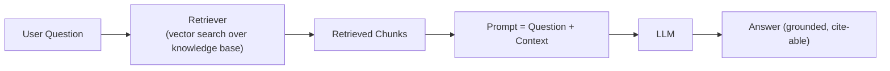
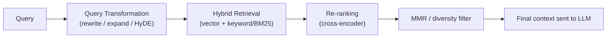
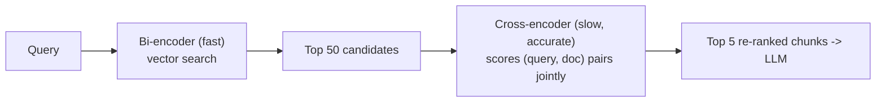
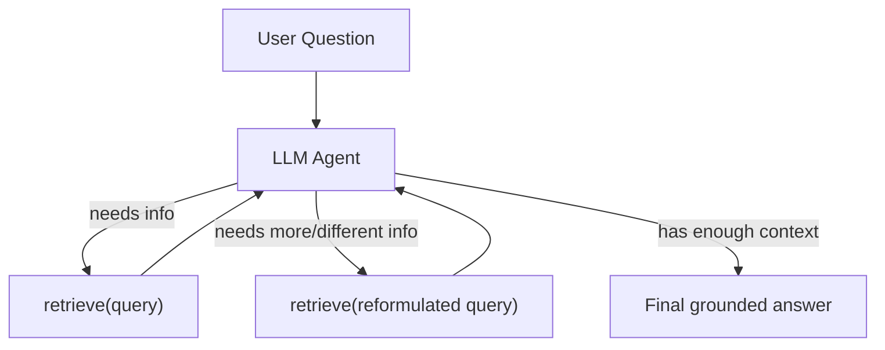
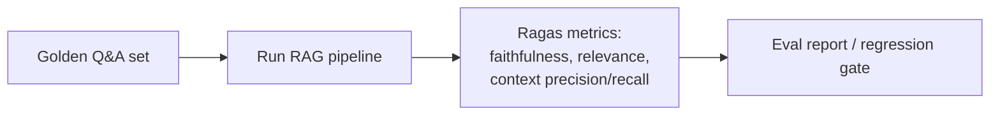

# 04. RAG — Retrieval-Augmented Generation (Beginner → Advanced)

## 1. Why RAG?

LLMs have two core problems RAG solves:
1. **Knowledge cutoff / missing private data** — the model doesn't know your internal docs, latest data, etc.
2. **Hallucination** — without grounding, the model guesses.

**RAG = give the model relevant, up-to-date, private context at query time, instead of retraining/fine-tuning it.**



## 2. Naive / Basic RAG Pipeline

```mermaid
flowchart TB
    subgraph Offline: "Indexing (once, or on data update)"
        D["Raw Documents (PDF, HTML, DB)"] --> L["Load"]
        L --> C["Chunk"]
        C --> E["Embed"]
        E --> V["Vector Store"]
    end
    subgraph Online: "Query Time (per request)"
        Q["User Query"] --> QE["Embed Query"]
        QE --> S["Similarity Search top-k"]
        V --> S
        S --> Ctx["Top-k chunks"]
        Ctx --> Prompt["Assemble Prompt\n(system + context + question)"]
        Prompt --> LLM["LLM"]
        LLM --> Ans["Final Answer + Sources"]
    end
```

Minimal LCEL implementation:

```python
from langchain_core.prompts import ChatPromptTemplate
from langchain_core.runnables import RunnablePassthrough
from langchain_core.output_parsers import StrOutputParser

prompt = ChatPromptTemplate.from_template(
    "Answer using ONLY the context below. If the answer isn't there, say you don't know.\n\n"
    "Context:\n{context}\n\nQuestion: {question}"
)

def format_docs(docs):
    return "\n\n".join(f"[{d.metadata.get('source')}] {d.page_content}" for d in docs)

rag_chain = (
    {"context": retriever | format_docs, "question": RunnablePassthrough()}
    | prompt
    | llm
    | StrOutputParser()
)

rag_chain.invoke("What is eventual consistency?")
```

## 3. Prompt Assembly & Grounding Rules

Good RAG prompts explicitly instruct the model to:
- Answer **only** from provided context (reduces hallucination).
- Say "I don't know" / "not found in the documents" if context is insufficient.
- Cite sources (page/section/file) so answers are verifiable.

```
System: You are a documentation assistant. Only use the CONTEXT below.
If the answer is not in the context, respond: "I don't have enough information."
Always cite the source file/page in brackets after each claim.

Context:
[ddia.pdf p.42] "...eventual consistency guarantees..."

Question: {question}
```

## 4. Retrieval Quality Levers (Basic → Advanced)



| Technique | What it does | Why |
|---|---|---|
| **Top-k tuning** | Retrieve more/fewer chunks | Too few → missing info; too many → noise + cost |
| **MMR (Maximal Marginal Relevance)** | Balances relevance vs diversity among retrieved chunks | Avoids 5 near-duplicate chunks |
| **Hybrid search** | Combine vector similarity + keyword/BM25 (sparse) search | Vector search misses exact terms (IDs, codes, acronyms) |
| **Re-ranking (cross-encoder)** | A second, more expensive model re-scores top ~50 candidates for true relevance | Bi-encoder (embedding) search is fast but approximate; cross-encoder reads query+doc together for higher precision |
| **Query rewriting / expansion** | LLM rewrites vague user query into a better search query | Users ask short/ambiguous questions |
| **HyDE (Hypothetical Document Embeddings)** | LLM generates a hypothetical answer first, embeds *that* to search | Hypothetical answer often matches real docs better than the raw question |
| **Multi-query retrieval** | Generate several reworded queries, retrieve for each, merge/dedupe | Improves recall |
| **Parent-document / small-to-big retrieval** | Embed small chunks for precision, but return the larger parent chunk/section for context | Best of both: precise matching + enough surrounding context |

### Cross-encoder re-ranking example



```python
from sentence_transformers import CrossEncoder

reranker = CrossEncoder("cross-encoder/ms-marco-MiniLM-L-6-v2")
pairs = [(query, doc.page_content) for doc in candidates]
scores = reranker.predict(pairs)
reranked = [d for _, d in sorted(zip(scores, candidates), reverse=True)][:5]
```

## 5. Advanced RAG Architectures

### 5.1 Agentic RAG

Instead of a fixed retrieve → generate pipeline, an agent **decides** whether/what/how many times to retrieve, and can loop.



### 5.2 Corrective RAG (CRAG)

Adds a **self-grading** step: after retrieval, the model (or a classifier) judges if retrieved docs are actually relevant; if not, it falls back to web search or query rewriting.

### 5.3 GraphRAG

Builds a knowledge graph (entities + relationships) from documents, and retrieval traverses the graph in addition to/instead of vector similarity — useful for multi-hop questions ("who reports to the manager of the person who approved X?").

## 6. RAG Evaluation

You cannot improve what you don't measure. Key metrics (popularized by **Ragas**):

| Metric | Question it answers |
|---|---|
| **Context precision** | Of the retrieved chunks, how many were actually relevant? |
| **Context recall** | Of all relevant chunks that exist, how many were retrieved? |
| **Faithfulness** | Does the answer only contain claims supported by the retrieved context (no hallucination)? |
| **Answer relevance** | Does the answer actually address the question asked? |



```python
from ragas import evaluate
from ragas.metrics import faithfulness, answer_relevancy, context_precision, context_recall
from datasets import Dataset

dataset = Dataset.from_dict({
    "question": questions,
    "answer": generated_answers,
    "contexts": retrieved_contexts,
    "ground_truth": golden_answers,
})
result = evaluate(dataset, metrics=[faithfulness, answer_relevancy, context_precision, context_recall])
```

## 7. Common Failure Modes & Fixes

| Symptom | Likely cause | Fix |
|---|---|---|
| Answers miss obvious info | Chunking too coarse/fine, low top-k | Tune chunk size/overlap, increase k, add re-ranking |
| Hallucinated citations | No grounding instruction, weak prompt | Explicit "only use context" instruction + faithfulness eval |
| Slow responses | Large k, expensive re-ranker, huge context | Cache embeddings, reduce k, async retrieval |
| Irrelevant chunks retrieved | Poor embedding model fit, no hybrid search | Try domain-tuned embeddings, add BM25 hybrid |
| Works in demo, fails in prod | No eval set, tested only "happy path" queries | Build golden Q&A eval set covering edge cases early |

---
⬅ Back: [03_Embeddings_VectorDB.md](03_Embeddings_VectorDB.md) | Next: [05_Agents_and_Tools.md](05_Agents_and_Tools.md)

## Mini Projects

- Basic RAG chatbot: [projects/02_rag_chatbot.py](projects/02_rag_chatbot.py)
- Advanced RAG (hybrid + re-ranking + citations): [projects/03_advanced_rag.py](projects/03_advanced_rag.py)
