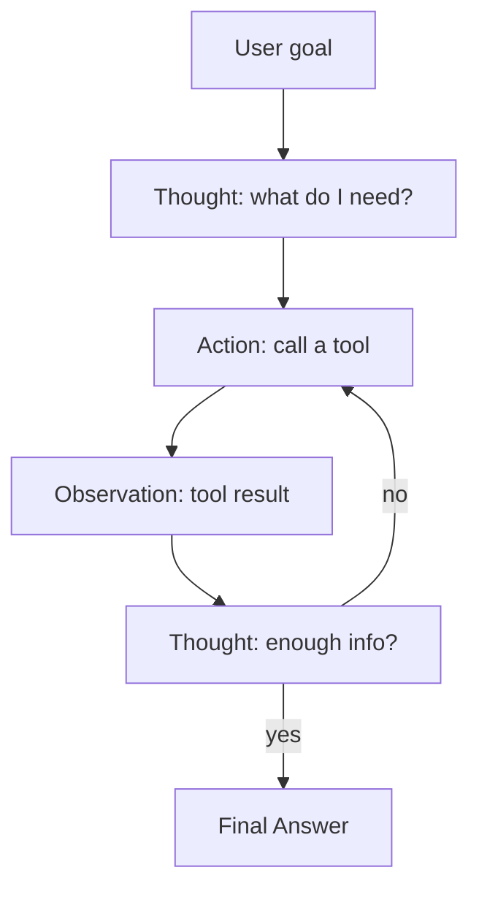
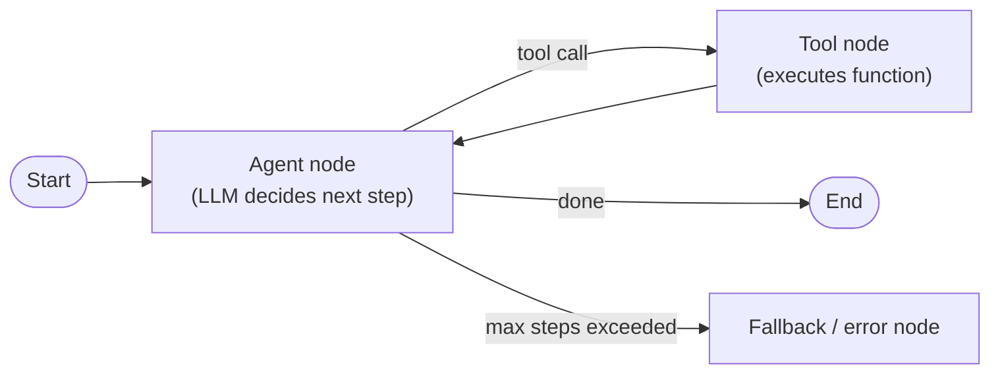
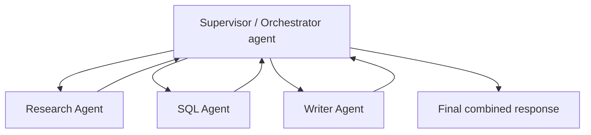

# 05. Agents & Tool Use

## 1. What is an Agent?

An **agent** is an LLM-driven loop that can decide which actions (tool calls) to take, observe results, and decide again — instead of a single fixed prompt→response call.



This **Thought → Action → Observation** loop is the classic **ReAct** pattern (Reason + Act).

## 2. Tool Calling Recap

See [02_LangChain_Fundamentals.md](02_LangChain_Fundamentals.md#8-basic-tool-calling) — agents are essentially tool calling **in a loop with state**, rather than a single call.

## 3. LangGraph (state-machine agents)

LangGraph models an agent as an explicit **graph of nodes and edges** (a state machine) instead of an implicit loop — this gives control, observability, and the ability to add guardrails (max steps, human approval, fallback nodes).



```python
from langgraph.prebuilt import create_react_agent

agent = create_react_agent(llm, tools=[sql_query_tool, summarize_tool])
result = agent.invoke({"messages": [("user", "How many orders failed QC last week?")]})
```

## 4. Memory

| Type | Scope | Example |
|---|---|---|
| **Short-term** | Current conversation | Message history passed back each turn |
| **Long-term** | Across sessions | User preferences stored in a DB, recalled/injected later |

Naive approach: just resend full history each turn (bounded by context window). Advanced: summarize older turns, or store key facts in a vector/KV store and retrieve relevant ones (memory-as-RAG).

## 5. Multi-Agent Patterns (conceptual)



- **Supervisor pattern**: one orchestrator agent delegates subtasks to specialist agents.
- **Frameworks**: LangGraph (fine control), CrewAI / AutoGen (higher-level role-based abstractions).

## 6. Guardrails Against Runaway Agents

- **Max iteration / step limits** — hard stop after N loop iterations.
- **Cost/token budget caps** per request.
- **Human-in-the-loop approval** for risky actions (e.g., before executing a DB write or sending an email).
- **Tool allowlists** — never give an agent unrestricted shell/file/network access; scope tools narrowly (e.g., read-only SQL, not `DROP TABLE`).
- **Timeouts** on tool execution to avoid hangs.

---
⬅ Back: [04_RAG_Fundamentals_to_Advanced.md](04_RAG_Fundamentals_to_Advanced.md) | Next: [06_Interview_Questions.md](06_Interview_Questions.md)

## Mini Project

- SQL Agent (tool calling + guardrails): [projects/04_sql_agent.py](projects/04_sql_agent.py)
